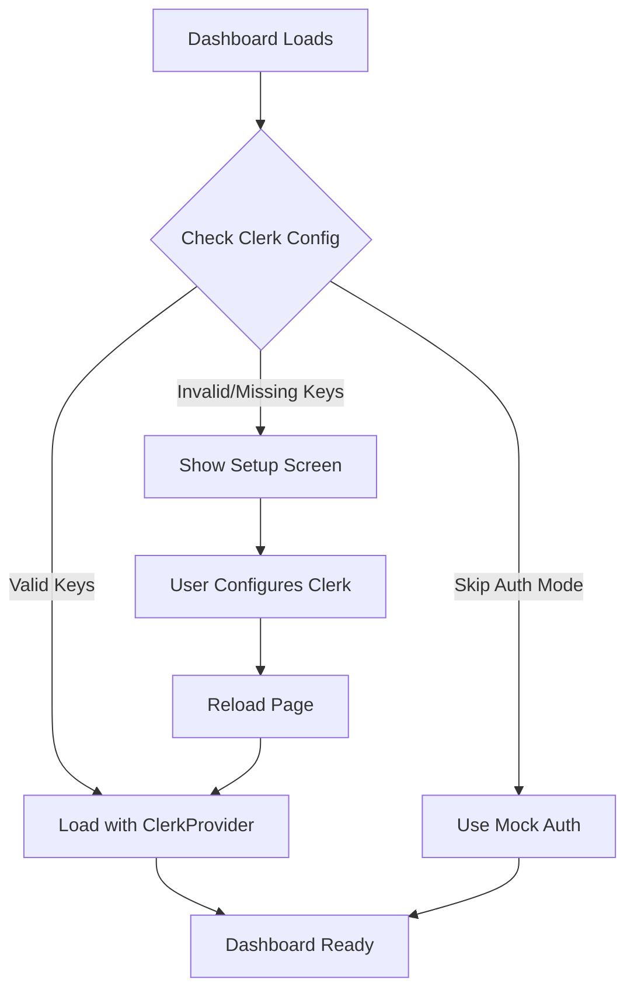

# Dashboard Authentication Setup

The dashboard now handles missing Clerk configuration gracefully with a helpful setup screen.

## Quick Start Options

### Option 1: Run Without Authentication (Development Only)

Add to your `.env.local`:
```env
NEXT_PUBLIC_SKIP_AUTH=true
```

Then restart the dev server:
```bash
npm run dev
```

This will run the dashboard with mock authentication for development.

### Option 2: Setup Clerk Authentication (Recommended)

1. **Create a Clerk Account**
   - Go to [https://dashboard.clerk.com](https://dashboard.clerk.com)
   - Sign up for a free account
   - Create a new application

2. **Get Your API Keys**
   - In Clerk dashboard, go to API Keys
   - Copy the Publishable Key and Secret Key

3. **Update Environment Variables**

   Edit `.env.local`:
   ```env
   # Remove or comment out skip auth if present
   # NEXT_PUBLIC_SKIP_AUTH=true

   # Add your Clerk keys
   NEXT_PUBLIC_CLERK_PUBLISHABLE_KEY=pk_test_YOUR_ACTUAL_KEY
   CLERK_SECRET_KEY=sk_test_YOUR_SECRET_KEY

   # Optional: Configure URLs
   NEXT_PUBLIC_CLERK_SIGN_IN_URL=/sign-in
   NEXT_PUBLIC_CLERK_SIGN_UP_URL=/sign-up
   NEXT_PUBLIC_CLERK_AFTER_SIGN_IN_URL=/
   NEXT_PUBLIC_CLERK_AFTER_SIGN_UP_URL=/
   ```

4. **Restart the Development Server**
   ```bash
   npm run dev
   ```

### Option 3: Use Existing Clerk Keys

If you have Clerk configured in another project (like the InfinityVault website), you can temporarily reuse those keys:

```bash
# Copy keys from existing project
cat ~/workspace/ecommerce-tools/platforms/infinityvault/website/frontend/.env.local | grep CLERK
```

## Features Added for Graceful Failure

### 1. **ClerkSetupGuard Component**
- Detects missing or invalid Clerk configuration
- Shows friendly setup instructions instead of black screen
- Provides quick setup steps and links

### 2. **SafeClerkProvider**
- Conditionally loads Clerk only when properly configured
- Falls back gracefully when keys are missing
- Supports development mode without authentication

### 3. **Mock Authentication (Dev Mode)**
- Provides mock user context in development
- Allows dashboard to function without Clerk setup
- Auto-signs in as "Dev User" when `NEXT_PUBLIC_SKIP_AUTH=true`

## How It Works



## Troubleshooting

### Still Seeing Black Screen?
1. Clear Next.js cache: `rm -rf .next`
2. Check browser console for specific errors
3. Verify `.env.local` is in the correct directory
4. Ensure keys start with `pk_test_` and `sk_test_`

### Error: "Invalid Clerk publishable key format"
- Your key doesn't start with `pk_`
- Double-check you copied the correct key from Clerk dashboard

### Error: "Failed to load Clerk"
- Network issue or Clerk service is down
- Check your internet connection
- Try again in a few minutes

## Environment Variables Reference

```env
# Required for production
NEXT_PUBLIC_CLERK_PUBLISHABLE_KEY=pk_test_xxx
CLERK_SECRET_KEY=sk_test_xxx

# Optional - Skip auth for development
NEXT_PUBLIC_SKIP_AUTH=true

# Optional - Customize auth URLs
NEXT_PUBLIC_CLERK_SIGN_IN_URL=/sign-in
NEXT_PUBLIC_CLERK_SIGN_UP_URL=/sign-up
NEXT_PUBLIC_CLERK_AFTER_SIGN_IN_URL=/
NEXT_PUBLIC_CLERK_AFTER_SIGN_UP_URL=/

# Optional - Organization/Workspace support
NEXT_PUBLIC_CLERK_ORGANIZATION_URL=/organizations
```

## Security Notes

- Never commit real API keys to git
- Use `.env.local` (already in .gitignore)
- In production, use environment variables from your hosting platform
- The `NEXT_PUBLIC_SKIP_AUTH` flag should NEVER be used in production